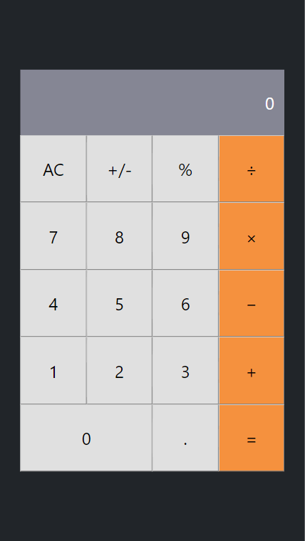
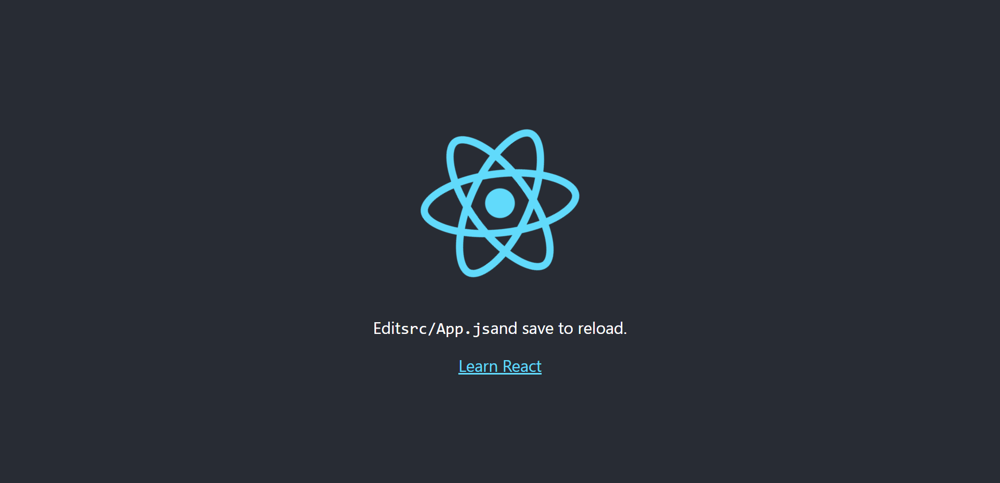

# Math Magicians

> "Math magicians" is a website for all fans of mathematics. It is a Single Page App (SPA) that allows users to:

- Make simple calculations.
- Read a random math-related quote.

This application is built using React and Bootstrap.

## Mobile

## Desktop

## Built With

- React
- VSCode
- Gitflow & GitHub

## Live Demo

[Live Demo Link](https://math-magicians.dicodiaz.com.co)

## Getting Started

To get this project up and running, follow these simple steps:

1. Clone the repository into your machine.
2. Open the project's folder with your preferred source-code editor.
3. Run `pnpm install`.
4. Run `pnpm dev`.

### Prerequisites

- Any modern web browser.
- Any source-code editor (VSCode recommended).

### Setup

- Follow the steps described before.

## Authors

👤 **Dico Diaz Dussan**

- GitHub: [@dicodiaz](https://github.com/dicodiaz)
- LinkedIn: [Dico Diaz Dussan](https://www.linkedin.com/in/dico-diaz-dussan/)
- Portfolio: [portfolio.dicodiaz.com.co](https://portfolio.dicodiaz.com.co)

## 🤝 Contributing

Contributions, issues, and feature requests are welcome!

Feel free to check the [issues page](https://github.com/mustabbas/TvMovies/issues).

## Show your support

Give a ⭐️ if you like this project!

## 📝 License

This project is [MIT](./MIT.md) licensed.
